title: Introduction to self-hosting with YunoHost
class: animation-fade
layout: true

---

class: impact

# Introduction to Self‑Hosting with YunoHost

## Workshop by Aleks & Elie

---

# Goal

- Discover the practice and possibilities of self-hosting with YunoHost

# Disclaimer

- This workshop was designed for beginners with little technical knowledge!
- Purists: sorry about the few technical shortcuts!

---

# Plan

## Boring part (~ 30 min)

- Generalities about self-hosting and YunoHost
- Some technical notions

## Cool part (~ 1h30)

- Hands-on !
- Install YunoHost on a VPS
- Play with apps, email, and so on

---

# Self-Hosting

- Having **your very own server**
    - a computer connected 24/7 that manages services like email, websites, file sync, ...
- Being **autonomous with your own data and services**
    - kinda similar to growing your own vegetables

.center[

]

---

# Self-Hosting

## Hardware

- **At home** ("true" self-hosting)
    - ARM-board (Raspberry-Pi like)
    - Old computer / laptop

- **On a remote server**
    - VPS (virtual private server)

---

.center[
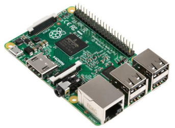

]

.center[

]

---

<br>
<br>
<br>

.center[
**But what can you hope to do**

**with a RaspberryPi ?**
]

---

# Self-Host: a blog

.center[

]

---

# Self-Host: file cloud, contacts/calendar

.center[
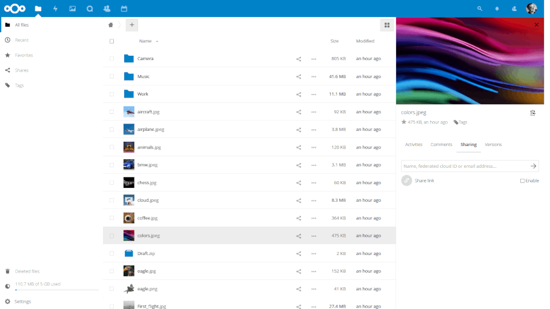
]

---

# Self-Host: a task manager

.center[

]

---

# Self-Host: emails

.center[
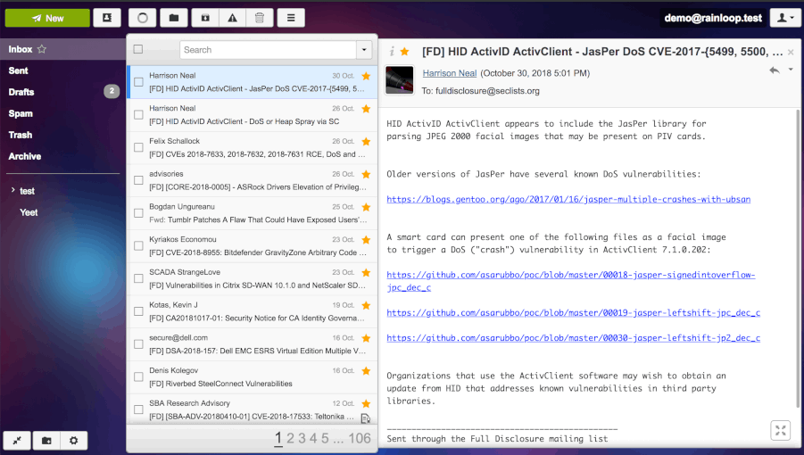
]

---

# Self-Host: mailing lists

.center[
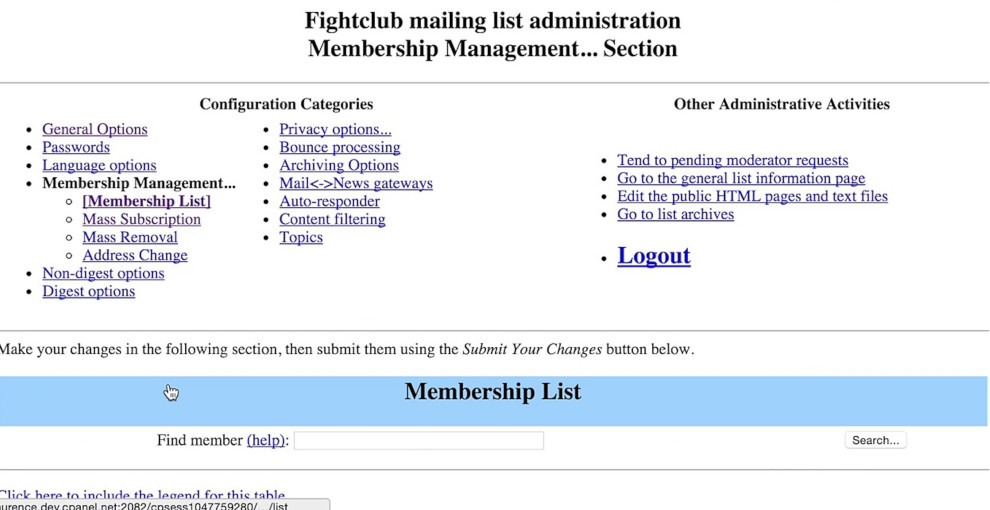
]

---

# Self-Host: social media

.center[
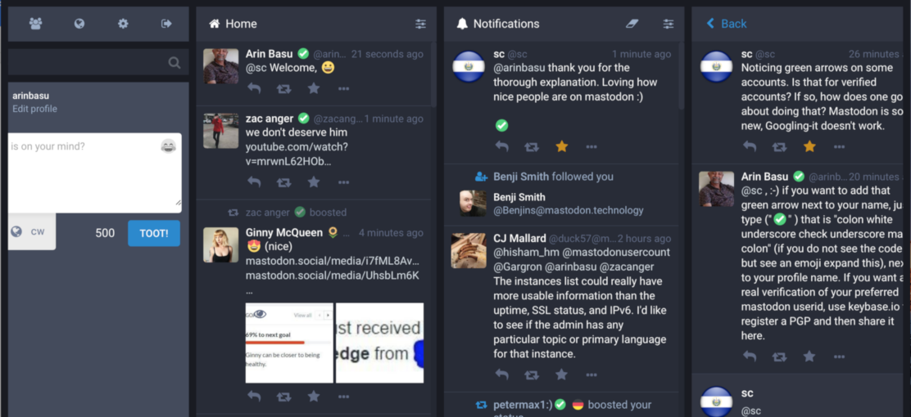
]

---

# Self-Host: your own website?

.center[
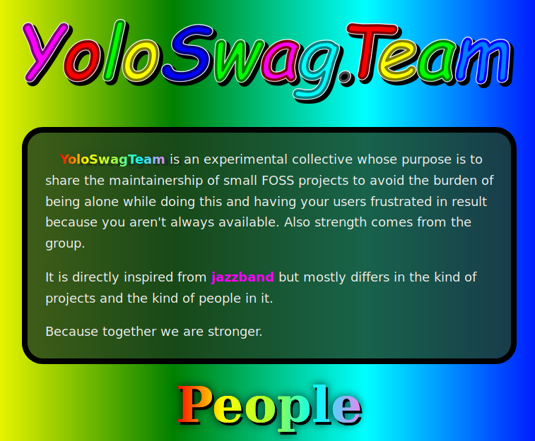
]

---

# Self-Hosting

## Why not just use Google and Facebook?

- **Political**
    - fight the GAFAM hegemony, escape surveillance capitalism
    - reclaim control (and responsability!) over your data and services
    - contribute to build a free / open / decentralized internet and save the wurld from cyberdistopia

- But also: **fun**, **pedagogical**

---

# Self-Hosting

## Public

- Individuals
- Group of friends
- Small association / club
- Small enterprise / company
- Small/medium-scale CHATONS / librehosters (10-100 users)

---

.center[

]

---

<br>

.center[

]

---

<br>

.center[

]

---

<br>

# Server administration is madness

- Requires **lot of technical knowledge / skills**
- And takes **hell of a time anyway**
- Evebody **somewhat reinvents the wheel everyday**
    - read the same READMEs / tutorial and apply "by hand"
    - lack of standardized, accessible environnement

.center[
=> not accessible
]

---

<br>
<br>

.center[

]


---

<br>
<br>
<br>
<br>

.center[
**But one way or another, we should be able to**

**have simple, accessible interfaces for simple use cases**
]

---

<br>
<br>

.center[

]

---

# YunoHost

## "The Ubuntu of Self-Hosting"

Basically
- a standardized setup (Debian + Nginx + Postfix + ...)
- accessible abstractions and interfaces
- does what you would do by hand ... but automagically!

---

# YunoHost: naming

.center[
« Y U No Host »


]

---

# YunoHost: naming

.center[
alternatively: « You (K)now Host »

<br>


]

---

# YunoHost: features

-  **Debian**-based (stable, robust, well-known)
-  Simple & clean **web administration interface**
-  Install **apps** in just a few clicks & questions
-   **Multi-users** with single sign-on (SSO) portal
-   **Email** and instant messaging (XMPP) out of the box
-  **Backups** (and restore!)
- Lots of other stuff for things to just works

---

# YunoHost

<br>

.center[
**Try it:**

**demo.yunohost.org**
]

---

# YunoHost: admin interface

.center[

]

---

# YunoHost: user portal

.center[

]

---

.center[
**YunoHost ecosystem**
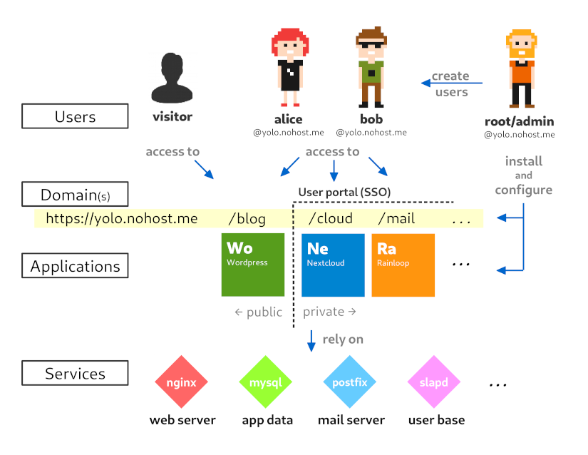
]

---

class: impact

# Technical notions

.center[
<small>You *don't need* to master all of these, <br>but having an idea of what is going on makes things easier</small>
]

---

# Technical notions

## Internet architecture

.center[
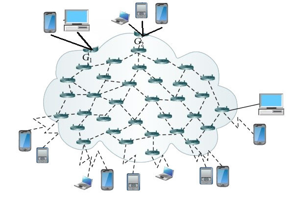
]

---

# Technical notions

## Internet architecture

.center[
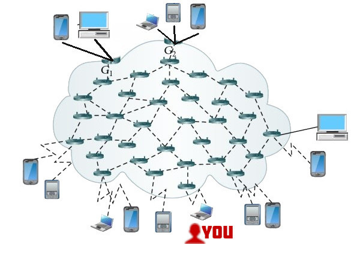
]

---

# Technical notions

## Internet architecture

.center[
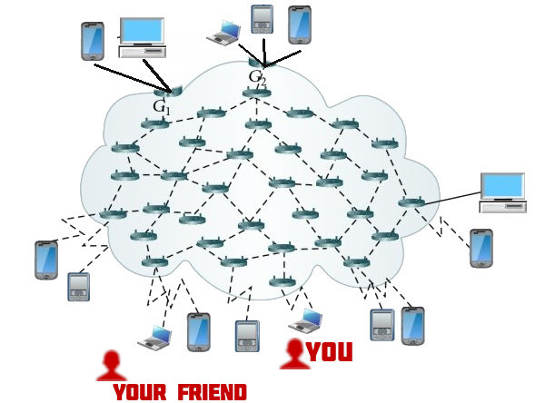
]

---

# Technical notions

## Internet architecture

.center[

]

---

# Technical notions

## Internet architecture

.center[
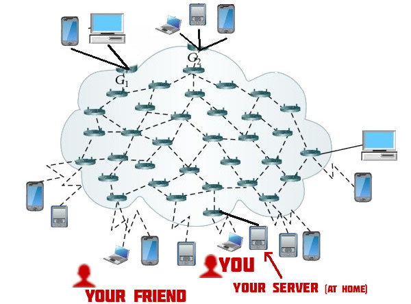
]

---

# Technical notions

## Server <small>(in terms of hardware)</small>

- A machine **dedicated to answering requests and serving stuff**
   - web pages, mail inboxes, instant messaging, ...
- **Typically available 24/7**, reachable on the Internets


---

# Technical notions

## Global IP / Local IP

- IP adresses are used to identify *machines*
- **Global (or public) IP address** make sense on the "global" internet
    - typically given by your ISP to your router
    - ~shared by multiple devices
- At home : **Local IP address** make sense only inside the local network
    - typically looks like `192.168.x.y` or `10.0.x.y`
    - (related to the lack of IPv4 ?)

---

# Technical notions

## Local network

.center[

]

---

# Technical notions

## Domain name and DNS

.center[

]

---

# Technical notions

## Domain name and DNS

.center[
human-readable name <-> IP address
]

- As a **human, it's easier to remember** `wikipedia.org` rather than `91.198.174.192`
- **DNS resolvers** translate domain name to IP
- (Also stores some technical infos (ex: spam counter-measure stuff))
- You can:
   - **buy domain names on DNS *registrars* **(ex: Gandi.net)
   - or get some for free (ex: netlib.re, nohost.me)

---

# Technical notions

## Remote control with SSH and command line

- Servers typically **don't have graphical interface nor keyboards**
- and usually you're not in the same room anyway !

.center[
-> need a way to remote control
]

---

# Technical notions

## Remote control with SSH and command line

- **SSH** stands for Secure SHell and is a protocol (default on port 22)
- **Remote control with command line interface**
- **Command line interface** is interacting with the system through "**written orders**"

---

# Technical notions

## Remote control with SSH and command line

```bash
$ ssh root@11.22.33.44
The authenticity of host '11.22.33.44' can't be established.
RSA key fingerprint is SHA256:CuPd7AtmqS0UE6DwDDG68hQ+qIT2tQqZqm8pfo2oBE8.
Are you sure you want to continue connecting (yes/no)? █ 
```

---

# Technical notions

## Remote control with SSH and command line

```bash
$ ssh root@11.22.33.44
The authenticity of host '11.22.33.44' can't be established.
RSA key fingerprint is SHA256:CuPd7AtmqS0UE6DwDDG68hQ+qIT2tQqZqm8pfo2oBE8.
Are you sure you want to continue connecting (yes/no)? yes
Warning: Permanently added '11.22.33.44' (RSA) to the list of known hosts.
Debian GNU/Linux 9
root@11.22.33.44's password:
```

---

# Technical notions

## Remote control with SSH and command line

```bash
$ ssh root@11.22.33.44
The authenticity of host '11.22.33.44' can't be established.
RSA key fingerprint is SHA256:CuPd7AtmqS0UE6DwDDG68hQ+qIT2tQqZqm8pfo2oBE8.
Are you sure you want to continue connecting (yes/no)? yes
Warning: Permanently added '11.22.33.44' (RSA) to the list of known hosts.
Debian GNU/Linux 9
root@11.22.33.44's password:

Last login: Thu Oct  4 08:52:07 2018 from 90.63.229.46
root@35c3-0:~$ █
```

---

class: impact

# Let's get to work !

## Installing your first YunoHost server

---

# Let's get to work !

1. Connect to your server
    - Each of you will have **a VPS** <small>(already bought them)</small>
    - With a terminal, **connect using SSH** to your server

---

# Let's get to work !

1. Connect to your server
    - Each of you will have **a VPS** <small>(already bought them)</small>
    - With a terminal, **connect using SSH** to your server
2. Install YunoHost 
    - Launch **YunoHost's install script**
    - Run the **postinstall** from the web admin interface
        - you'll have to choose a **domain name** <small>(`something.nohost.me`)</small>

---

# Let's get to work !

1. Connect to your server
    - Each of you will have **a VPS** <small>(already bought them)</small>
    - With a terminal, **connect using SSH** to your server
2. Install YunoHost 
    - Launch **YunoHost's install script**
    - Run the **postinstall** from the web admin interface
        - you'll have to choose a **domain name** <small>(`something.nohost.me`)</small>
3. Play with you server !
    - Add a **first user**
    - Install **apps** (e.g. : Nextcloud) and test **email**
    - ???
    - Get to know YunoHost and **enjoy your server!**

---

class: impact

# Closing words

---

# Closing words

- To **continue the adventure** in real life:
    - buy a Raspberry-Pi-like ARM board
    - buy a VPS online (e.g. from Scaleway, ~2€/month)

- YunoHost is **far from perfect!**
    - Servers are fragile creatures, don't mess too much with them just for fun!
    - Your server is either a production server or a test server ;)

- **Backups !**

---

# Moar documentation !

- Install guide : `yunohost.org/install`
- Admin documentaiton `yunohost.org/admindoc`

.center[

]

---

# Contact me for questions!

- **Mastodon**: `cybre.space/@aleks`
- **GitHub**: `github.com/alexAubin`
- **Matrix**: `@Alekswag:matrix.org`

Find the YunoHost team on :

- **IRC**: `#yunohost` and `#yunohost-dev` on `irc.freenode.org`
- **Matrix**: `#freenode_#yunohost:matrix.org`
- **Forum**: `forum.yunohost.org`
- **Mastodon**: `mastodon.social/@yunohost`

---

class: impact

# Thank you for attending !

## <3

