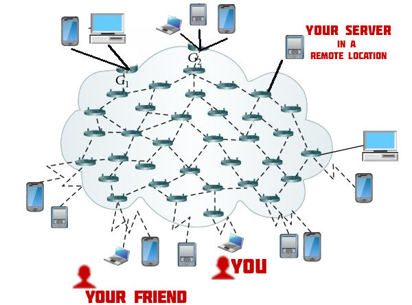

title: Initiation pratique à l'auto-hébergement avec YunoHost
class: animation-fade
layout: true

---

class: impact

# Initiation pratique à l'auto-hébergement


## Atelier par Aleks / JDLL 2019

---

# Objectif

- Découvrir en pratique l'auto-hébergement : qu'est-ce que c'est, comment ça marche

<br>

# Précisions

- Cet atelier est pour un public *débutant* avec peu de connaissances techniques !
- Désolé pour les puristes si il y a des approximations techniques !

---

# Plan

1. **Blabla général** sur l'auto-hébergement **(~15 min)**
2. **Blabla technique** : réseau, adresse IP, nom de domaine ... **(~15 min)**
3. **Les mains dans le camboui !** Installation de YunoHost **(~30 min)**
4. **Jouer avec son serveur** : installer des apps, tester le mail ... **(~30 min)**

---

# C'est l'histoire de ...

- Une famille
- Un groupe d'ami.e.s
- Une association
- Une petite entreprise
- Un (petit) CHATON
- ...

.center[
qui veulent **partager des données et travailler ensemble**
]

---

# Partager des données, travailler ensemble

- partager des photos
- raconter leur vacances sur un blog
- avoir un site pour l'asso / l'entreprise
- chatter ou s'écrire des mails
- partager / synchroniser des fichiers, calendrier, contacts, musique, ...
- écrire des documents à plusieurs
- gérer des tâches
- ...

---

.center[
# Le capitalisme de surveillance 

### Des services "gratuits" ... contre vos données qui seront vendues et analysées <small>(et vos âmes qui sera manipulées)</small>


]

---

# Alternative "bio" : l'autohébergement 

- Avoir **son propre serveur**
    - un ordinateur connecté 24h/24, 7j/7, qui gère un site web, un cloud de fichier, des boîte mail, des outils de travail collaboratif, ...
- Être **autonome** et **responsable** de ses données et services <small>... ... et possiblement de celles d'autres personnes !</small>
    - un peu comme avoir son propre potager

.center[

]

---

# L'auto-hébergement

## À la maison

.col-6[
.center[
**Carte ARM**

(type Raspberry Pi)


]
]

.col-6[
.center[
**Vieil ordinateur**

(tour ou portable)


]
]


---

# L'auto-hébergement

## Sur un serveur en ligne

.center[
**VPS** (virtual private server)


]


---

# L'auto-hébergement

## Sur un serveur en ligne <small>(dans le "klaoude")</small>

.center[
**VPS** (virtual private server)

Alsace Réseau Neutre, OVH, Scaleway, Digital Ocean, ...

]

---

# L'auto-hébergement

## Sur un serveur en ligne <small>(dans le "klaoude")</small>

.center[
**VPS** (virtual private server)

Alsace Réseau Neutre, OVH, Scaleway, Digital Ocean, ...

]


---

.center[
<br>
<br>
<br>
<br>
**Mais qu'est-ce qu'on peut vraiment espérer faire**

**avec "juste" un RaspberryPi ?**
]

---

# <small>Briques logicielles pour construire son serveur</small>

.center[

]

---

# Auto-héberger : un blog

.center[

]

---

# Auto-héberger : un site

.center[

]

---

# Auto-héberger : un cloud de fichier, contacts, calendrier

.center[

]

---

# Auto-héberger : un tableau de gestion de tâche

.center[

]

---

# Auto-héberger : ses mails

.center[

]

---

# Auto-héberger : <small>des listes de discussion</small>

.center[

]

---

# Auto-héberger : <small>un bout de réseau social</small>

.center[

]

---

.center[

]

---

<br>

.center[

]

---

.center[

]

## "Le Ubuntu de l'auto-hébergement"

- un environnement standardisé (Debian + Nginx + Postfix + ...)
- des abstractions et interfaces accessibles
- fait ce que vous auriez fait à la main ... mais automagiquement !

---

# YunoHost: le nom

.center[
« Y U No Host »


]

---

# YunoHost: le nom (2)

.center[
alternative: « You (K)now Host »

<br>


]

---

# YunoHost: fonctionnalités

-  Basé sur **Debian** (stable, robuste, connu)
-  Une **interface web d'administration** simple et propre
-  Installer **pleins d'apps** en quelques clics!
-   **Multi-utilisateur.ice.s** avec un portail SSO <small>(authentification unique)</small>
-   **Email** et **messagerie instantannée** (XMPP) <small>(out of the box)</small>
-  Gestion des **sauvegardes** (et restauration!)
- Et *pleins de bidules pour que ça juste marche*

---

# YunoHost

<br>

.center[
**Ça s'essaye sur :**

**demo.yunohost.org**
]

---

# YunoHost: interface admin

.center[

]

---

# YunoHost: portail utilisateur

.center[

]

---

.center[
### L'ecosysteme YunoHost

]

---

class: impact

# Notions techniques

.center[
<small>*Pas besoin* de maîtriser ces notions, <br>mais avoir une idée / intuition simplifie les choses</small>
]

---

# Notions techniques

## Architecture d'Internet

.center[

]

---

# Notions techniques

## Architecture d'Internet

.center[

]

---

# Notions techniques

## Architecture d'Internet

.center[

]

---

# Notions techniques

## Architecture d'Internet

.center[

]

---

# Notions techniques

## Architecture d'Internet

.center[

]

---

# Notions techniques

## Serveur <small>(au sens matériel)</small>

- Un ordinateur dédié à **répondre à des requêtes et servir du contenu**
   - pages web, mails, messagerie instantannée, fichiers, ...
- Connecté sur Internet et **disponible 24H/24 7J/7**


---

# Notions techniques

## Adresses IP globale / locale

- Les adresses IP sont utilisées pour identifier des *machines*
- Les **adresses IP globale (ou publique)** font sens sur l'"Internet mondial"
    - ressemble à `145.82.156.93`
    - attribuée à votre MachinBox par votre fournisseur d'accès
    - possiblement partagée par plusieurs appareils
- À la maison : les **adresses IP locales** font sens seulement à l'intérieur du réseau local
    - typiquement, ressemble à `192.168.x.y` ou `10.0.x.y`

---

# Notions techniques

## Réseau local

.center[

]

---

# Notions techniques

## Nom de domaine et DNS

.center[

]

---

# Notions techniques

## Nom de domaine et DNS

.center[
nom pour les êtres humains -> adresse IP
]

- En tant qu'**humain, il est plus facile de se souvenir** de `wikipedia.org` que de `91.198.174.192`
- Les **résolveur DNS** permettent de faire la conversion de nom en IP
- On peut:
   - **acheter un domaine chez un *registrar* DNS** (ex: Gandi.net)
   - ou bien obtenir un domaine gratuit (ex: nohost.me, netlib.re)
- <small>(Le DNS stocke également des infos pour combattre le spam)</small>

---

# Notions techniques

## Contrôle à distance avec SSH et la ligne de commande

- Typiquement, les serveurs **n'ont pas d'interface graphique ou de clavier**
- Et de toute façon on est rarement dans la même piece que son serveur !

.center[
### -> il faut un moyen de contrôle à distance
]

---

# Notions techniques

## Contrôle à distance avec SSH et la ligne de commande

- **SSH** est un acronyme pour Secure SHell et est un protocole (port 22 par defaut)
- **Prise de controle à distance en ligne de commande**
- **La ligne de commande** est une façon d'interagir avec le système à travers des "**ordres écrits**"

---

# Notions techniques

## Contrôle à distance avec SSH et la ligne de commande

```bash
$ ssh root@11.22.33.44
The authenticity of host '11.22.33.44' can't be established.
RSA key fingerprint is SHA256:CuPd7AtmqS0UE6DwDDG68hQ+qIT2tQqZqm8pfo2oBE8.
Are you sure you want to continue connecting (yes/no)? █ 
```

---

# Notions techniques

## Contrôle à distance avec SSH et la ligne de commande

```bash
$ ssh root@11.22.33.44
The authenticity of host '11.22.33.44' can't be established.
RSA key fingerprint is SHA256:CuPd7AtmqS0UE6DwDDG68hQ+qIT2tQqZqm8pfo2oBE8.
Are you sure you want to continue connecting (yes/no)? yes
Warning: Permanently added '11.22.33.44' (RSA) to the list of known hosts.
Debian GNU/Linux 9
root@11.22.33.44's password:
```

---

# Notions techniques

## Contrôle à distance avec SSH et la ligne de commande

```bash
$ ssh root@11.22.33.44
The authenticity of host '11.22.33.44' can't be established.
RSA key fingerprint is SHA256:CuPd7AtmqS0UE6DwDDG68hQ+qIT2tQqZqm8pfo2oBE8.
Are you sure you want to continue connecting (yes/no)? yes
Warning: Permanently added '11.22.33.44' (RSA) to the list of known hosts.
Debian GNU/Linux 9
root@11.22.33.44's password:

Last login: Thu Oct  4 08:52:07 2018 from 90.63.229.46
root@jdll-0:~$ █
```

---

class: impact

# Mettons les mains dans le camboui !

## Installer son premier serveur YunoHost

---

# Mettons les mains dans le camboui !

1. Se connecter à son serveur
    - Chacun.e d'entre-vous va avoir **un VPS** <small>(fourni gracieusement par Alsace Réseau Neutre !)</small>
    - Lancer un terminal et **se connecter en SSH**

---

# Mettons les mains dans le camboui !

1. Se connecter à son serveur
    - Chacun.e d'entre-vous va avoir **un VPS** <small>(fourni gracieusement par Alsace Réseau Neutre !)</small>
    - Lancer un terminal et **se connecter en SSH**
2. Installer YunoHost 
    - Lancer **le script d'installation de YunoHost**
    - Ensuite, faire la **postinstallation** depuis l'interface web
        - il vous faudra choisir un **nom de domaine** <small>(`cequevousvoulez.nohost.me`)</small>

---

1. Se connecter à son serveur
    - Chacun.e d'entre-vous va avoir **un VPS** <small>(fourni gracieusement par Alsace Réseau Neutre !)</small>
    - Lancer un terminal et **se connecter en SSH**
2. Installer YunoHost 
    - Lancer **le script d'installation de YunoHost**
    - Ensuite, faire la **postinstallation** depuis l'interface web
       - il vous faudra choisir un **nom de domaine** <small>(`cequevousvoulez.nohost.me`)</small>
3. "Jouer" avec son serveur !
    - Ajouter un **premier utilisateur**
    - Installer des  **apps** (par ex. : Nextcloud) et tester **l'email**
    - ...
    - Apprenez à connaître YunoHost et **tester d'autres possibilités**

---

class: impact

# Clôture de l'atelier

---

# Clôture de l'atelier

- Pour **continuer l'aventure** dans la vraie vie :
    - acheter une carte ARM comme un Raspberry Pi
    - ... ou acheter un VPS en ligne <small>(ARN, OVH, Scaleway, Digital Ocean...)</small>

- YunoHost est **loin d'être parfait!**
    - Les serveurs sont des créatures fragiles, il ne faut pas trop les maltraîter juste pour le fun !...
    - Votre serveur est soit un serveur de prod, soit un serveur de test ;)

- S'organiser pour les **sauvegardes !**

---

# Moar documentation !

- Guide d'installation : `yunohost.org/install`
- Documentation de l'administrateur : `yunohost.org/admindoc`

.center[

]

---

# Contact

- **Mastodon**: `cybre.space/@aleks`
- **GitHub**: `github.com/alexAubin`
- **Matrix**: `@Alekswag:matrix.org`

Ou bien retrouvez l'équipe sur :

- Le **Forum**: `forum.yunohost.org`
- **Mastodon**: `mastodon.social/@yunohost`
- **IRC**: `#yunohost` and `#yunohost-dev` on `irc.freenode.org`
- **Matrix**: `#freenode_#yunohost:matrix.org`

---

class: impact

# Merci d'être venu !

## <3

